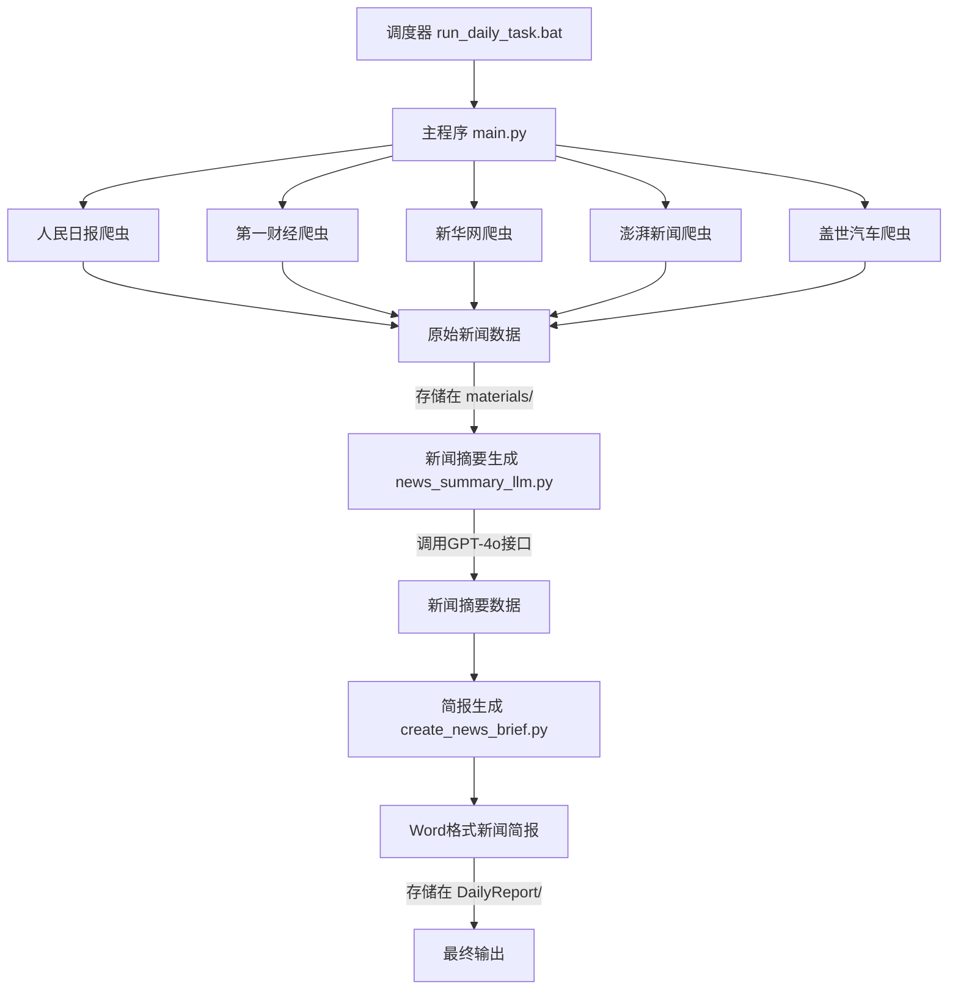

# DailyKnows - 每日新闻自动简报系统

DailyKnows是一个基于Playwright和LLM自动化新闻收集、摘要和简报生成系统。该系统自动从多个新闻源爬取最新新闻，使用AI筛选和生成摘要，并创建格式化的日报文档。

## 功能特点

- 🔍 自动爬取多个主流新闻源的最新新闻&利用OpenAI GPT-4o选取重点新闻
- 🤖 利用OpenAI GPT-4o自动生成新闻摘要和分类标签
- 📄 自动创建格式化的Word新闻简报文档，包含多个分类板块
- 📊 自动获取并分析汽车相关企业股票市场表现
- 🔄 智能去重功能，避免重复收集昨日新闻
- ⏱️ 支持定时任务调度，可设置每日自动执行
- 📧 可选的电子邮件通知功能

## 系统要求

- Python 3.8+
- Windows系统
- 必要的Python库（见requirements.txt）
- OpenAI API密钥

## 安装步骤

1. 克隆或下载此仓库到本地

2. 安装所需依赖
```bash
pip install -r requirements.txt
```

3. 安装Playwright浏览器
```bash
playwright install
```

4. 配置环境变量（复制.env.example为.env并填写相关配置）
```
# API密钥设置
OPENAI_API_KEY=your_openai_api_key

# 邮件设置（可选）
EMAIL_SENDER=your_email@example.com
EMAIL_PASSWORD=your_email_password
EMAIL_RECEIVER=receiver@example.com
SMTP_SERVER=smtp.example.com
SMTP_PORT=587
```

## 使用方法

### 手动运行

执行主程序来运行完整的新闻处理流程：

```bash
python main.py
```


```bash
python company_share.py
```

### 定时任务

使用批处理脚本设置每日自动执行：

```bash
run_daily_task.bat
```

## 系统流程图

以下流程图展示了系统各组件之间的数据流转过程：



## 技术栈

- Playwright - 用于自动化网页爬取
- OpenAI GPT-4o - 用于新闻摘要生成
- python-docx - 用于生成Word文档
- OpenCV与PyTesseract - 用于图像处理和OCR识别
- PyAutoGUI - 用于自动化控制桌面应用程序

## 注意事项

- 请确保API密钥和各项配置正确设置
- 网络爬虫使用请遵守相关网站的使用条款和robots.txt规则
- 生成的新闻简报仅供个人参考，请勿用于商业用途

## 许可证

MIT 