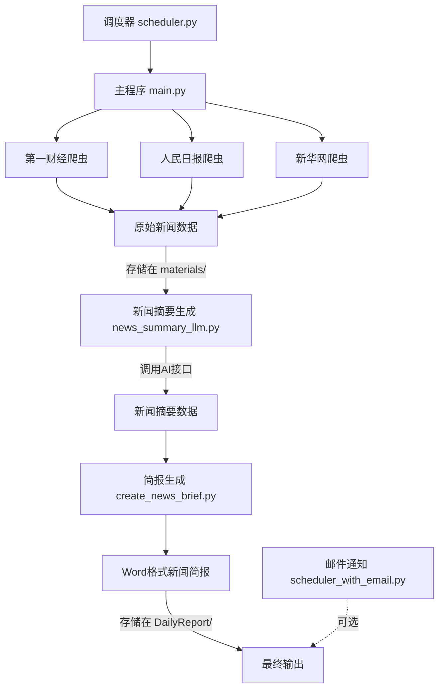

# DailyKnows - 每日新闻自动简报系统

DailyKnows是一个自动化新闻收集、摘要和简报生成系统。该系统自动从多个新闻源爬取最新新闻，使用AI生成摘要，并创建格式化的日报文档。

## 功能特点

- 🔍 自动爬取多个新闻源（第一财经、人民日报、新华网）的最新新闻
- 🤖 利用AI技术自动生成新闻摘要
- 📄 自动创建格式化的Word新闻简报文档
- ⏱️ 支持定时任务调度，可设置每日自动执行
- 📧 可选的电子邮件通知功能

## 系统要求

- Python 3.8+
- Windows系统（批处理脚本）

## 安装步骤

1. 克隆或下载此仓库到本地

2. 安装所需依赖
```bash
pip install -r requirements.txt
```

3. 安装Playwright浏览器
```bash
playwright install
```

4. 配置环境变量（复制.env.example为.env并填写相关配置）
```
# API密钥设置
OPENAI_API_KEY=your_openai_api_key

# 邮件设置（可选）
EMAIL_SENDER=your_email@example.com
EMAIL_PASSWORD=your_email_password
EMAIL_RECEIVER=receiver@example.com
SMTP_SERVER=smtp.example.com
SMTP_PORT=587
```

## 使用方法

### 手动运行

执行主程序来运行完整的新闻处理流程：

```bash
python main.py
```

### 定时任务

使用批处理脚本设置每日自动执行：

```bash
run_daily_task.bat
```

或者使用调度器脚本：

```bash
python scheduler.py
```

带邮件通知的调度器：

```bash
python scheduler_with_email.py
```

## 系统流程图

以下流程图展示了系统各组件之间的数据流转过程：



## 项目结构

- `main.py` - 主程序，协调所有模块的执行
- `news_crawler_playwright_*.py` - 各新闻源的爬虫脚本
- `news_summary_llm.py` - 使用AI生成新闻摘要
- `create_news_brief.py` - 生成格式化的Word新闻简报
- `scheduler.py` - 任务调度器
- `scheduler_with_email.py` - 带邮件通知的任务调度器
- `materials/` - 存储爬取的新闻原始数据
- `DailyReport/` - 存储生成的新闻简报
- `Prompt/` - AI提示词模板

## 注意事项

- 请确保API密钥和各项配置正确设置
- 网络爬虫使用请遵守相关网站的使用条款
- 生成的新闻简报仅供个人参考，请勿用于商业用途

## 许可证

MIT 